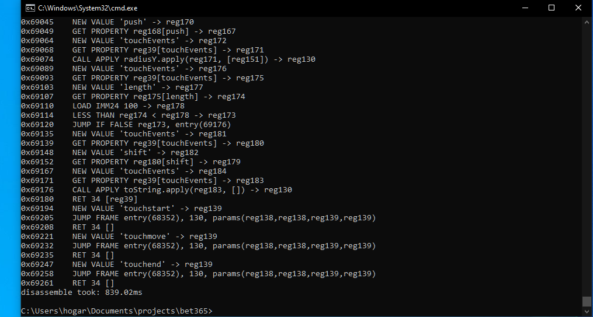

# bet365 — Custom JavaScript VM Bytecode Disassembler

A bytecode disassembler written in Rust, built to reverse-engineer the custom virtual machine (VM) embedded inside bet365's obfuscated JavaScript client. The tool decodes base64-encoded bytecode, walks the instruction stream byte by byte, and prints a human-readable disassembly trace annotated with byte offsets.

---

## Background and Motivation

Modern web applications — particularly those in high-value industries like online gambling — invest heavily in client-side obfuscation to prevent reverse engineering of their business logic, anti-bot systems, and integrity checks.

One of the most sophisticated obfuscation techniques is the implementation of a **custom virtual machine inside JavaScript**. Instead of shipping readable JavaScript, the developer compiles their logic into a proprietary bytecode format and ships a JavaScript-based interpreter alongside it. The interpreter reads and executes the bytecode at runtime. To a static analysis tool or a human reading the source, the actual logic is completely hidden — all that is visible is the interpreter loop and an opaque binary blob.

This project is a purpose-built disassembler for one such VM. By studying the interpreter's source (after deobfuscating the outer JavaScript layer), it is possible to reconstruct the instruction set, understand the encoding format, and build a tool that translates the raw bytecode back into readable pseudo-assembly. This is a standard technique in binary reverse engineering applied to the JavaScript domain.

---

## What is a Bytecode Disassembler?

A **disassembler** is a program that reads raw binary data (bytecode) and translates it back into a symbolic, human-readable representation of the instructions it encodes. It is the inverse of an assembler.

In traditional compiled languages (C, C++), a disassembler reads machine code (x86, ARM, etc.) and produces assembly language. In this project, the target is not machine code but a **custom bytecode** — a proprietary binary format defined by the bet365 VM. The principles are identical:

1. Read a byte (or sequence of bytes) that identifies the instruction (the **opcode**).
2. Read the subsequent bytes that supply the instruction's arguments (the **operands**).
3. Format and print the decoded instruction in a readable form.
4. Advance the read pointer and repeat until the end of the byte stream.

---

## Virtual Machine Architecture

The target VM is **register-based**. This is an important architectural distinction:

- **Stack-based VMs** (e.g., the JVM, CPython, WebAssembly) operate by pushing and popping values on an operand stack. Instructions implicitly consume their inputs from the top of the stack.
- **Register-based VMs** (e.g., Lua 5, Dalvik/Android) operate on a fixed array of named storage slots called registers. Instructions explicitly name which registers hold their inputs and where to write their output.

The bet365 VM uses 256 registers (`reg0` through `reg255`). Each instruction encodes its operand registers as single bytes (since a single byte can address 0–255). This is why the disassembler maintains a `registers: Vec<String>` array of 256 slots — it tracks which string values have been loaded into each register so that subsequent instructions can be annotated with the actual value rather than just the register number.

---

## Bytecode Encoding

### Base64 Transport

The raw bytecode is not stored as a binary file. It is encoded as a **base64 string** — a standard encoding that represents arbitrary binary data using only printable ASCII characters. This makes it trivial to embed inside a JavaScript string literal or a text file.

The `bytearray.rs` module handles decoding:

```rust
pub fn decode_bytecode(mut b64string: String) -> Vec<u8> {
    b64string.retain(|c| !c.is_whitespace());
    general_purpose::STANDARD.decode(b64string).unwrap()
}
```

Whitespace is stripped first (base64 strings are often line-wrapped), then the standard base64 alphabet is used to decode the string into a raw `Vec<u8>` — a contiguous array of bytes that the disassembler then walks sequentially.

### String Obfuscation (XOR Cipher)

String literals embedded in the bytecode are not stored in plaintext. They are XOR-encoded with the key `50` (decimal). The `decode_value` method in `disassembler.rs` handles this:

```rust
pub fn decode_value(&mut self) -> String {
    let string_len: u32 = self.get_pointer_byte();
    let mut string: String = String::new();

    for _ in 0..string_len {
        let byte = self.get_byte();
        let c: char = std::char::from_u32((byte as u32) ^ 50).unwrap();
        string.push_str(&c.to_string());
    }
    string
}
```

The length of the string is encoded as a 16-bit big-endian integer (two bytes), followed by the XOR-encoded character bytes. XOR is a symmetric cipher — applying the same key twice recovers the original value — making it a common lightweight obfuscation technique in custom VMs.

### 16-bit Pointer Encoding

Many operands that represent memory addresses or lengths are encoded as **16-bit big-endian unsigned integers** (two bytes). The `get_pointer_byte` method reads them:

```rust
fn get_pointer_byte(&mut self) -> u32 {
    let byte1 = (self.bytearray[self.ptr] as u32) << 8;
    self.ptr += 1;
    let byte2 = byte1 | (self.bytearray[self.ptr] as u32);
    self.ptr += 1;
    byte2
}
```

The first byte is shifted left by 8 bits (making it the high byte), then ORed with the second byte (the low byte). This is standard big-endian (network byte order) decoding.

### 24-bit Integer Encoding

Jump targets and function entry points are encoded as **32-bit big-endian integers** (four bytes), read by `get_int24`:

```rust
pub fn get_int24(&mut self) -> u32 {
    let byte: u32 = (self.get_byte() as u32) << 24
                  | (self.get_byte() as u32) << 16
                  | (self.get_byte() as u32) << 8
                  | (self.get_byte() as u32);
    byte
}
```

Despite the name `get_int24`, this reads four bytes and assembles a full 32-bit value. The name reflects the VM's internal naming convention for this operand type.

### IEEE 754 Double-Precision Float Decoding

Numeric constants are stored as raw **64-bit IEEE 754 double-precision floating-point** values. The `read_double` method decodes this manually from the bit level:

```rust
pub fn read_double(&mut self) -> f64 {
    // reads 8 bytes, builds a 64-bit binary string
    // extracts sign (bit 0), exponent (bits 1-11), mantissa (bits 12-63)
    // reconstructs: value = sign * mantissa * 2^(exponent - 1023)
}
```

The IEEE 754 double format is:
- **Bit 63**: Sign (0 = positive, 1 = negative)
- **Bits 62–52**: Biased exponent (stored value = actual exponent + 1023)
- **Bits 51–0**: Mantissa (fractional part, with an implicit leading 1 bit for normalized numbers)

Decoding this manually (rather than using a transmute or byte-cast) makes the process explicit and educational — it demonstrates exactly how floating-point numbers are represented in memory.

---

## Opcode Dispatch Table

The disassembler uses a **HashMap-based dispatch table** to map opcode bytes to handler functions:

```rust
pub fn get_instructions() -> HashMap<u8, InstructionType> {
    let mut instructions: HashMap<u8, InstructionType> = HashMap::new();
    instructions.insert(124, Instructions::init_memory);
    instructions.insert(23,  Instructions::new_value);
    // ... 36 entries total
    instructions
}
```

`InstructionType` is a function pointer type: `fn(&mut Disassembler)`. Each handler receives a mutable reference to the disassembler, reads its operands by advancing the pointer, and pushes a formatted string to the `trace` vector.

This pattern — a table mapping opcode bytes to handler functions — is the same architecture used by the VM itself. The disassembler mirrors the interpreter's dispatch loop, but instead of executing the instructions, it decodes and prints them.

The main execution loop in `disassembler.rs`:

```rust
pub fn execute(&mut self) {
    let instructions = Instructions::get_instructions();
    while self.ptr < self.bytearray.len() {
        let offset = self.bytearray[self.ptr];
        self.ptr += 1;

        if let Some(opcode) = instructions.get(&offset) {
            opcode(self);
            let last_instr = self.trace[self.trace.len() - 1].clone();
            let new_instr = format!("0x{}    {}", self.ptr, last_instr);
            println!("{}", new_instr);
        } else {
            panic!("Unknown Opcode: {}", offset)
        }
    }
}
```

If an unknown opcode byte is encountered, the program panics with the byte value — this is intentional. It signals that the instruction set mapping is incomplete and needs to be extended.

---

## Register Tracking

A key feature of this disassembler is **register value tracking**. When a `NEW VALUE` instruction loads a string into a register, the disassembler stores that string in its own `registers` array:

```rust
fn new_value(disasm: &mut Disassembler) {
    let reg: u8 = disasm.get_byte();
    let value: String = disasm.decode_value();
    disasm.trace.push(format!("NEW VALUE '{}' -> reg{}", value, reg));
    disasm.registers[reg as usize] = value;  // <-- tracked
}
```

Later, when an instruction references that register (e.g., `GET PROPERTY`), the disassembler substitutes the known string value instead of printing the generic register name:

```rust
fn get_property(disasm: &mut Disassembler) {
    let reg: u8 = disasm.get_byte();
    let obj_reg = disasm.get_byte();
    let prop_reg = disasm.get_byte();

    let val: String = if &disasm.registers[prop_reg as usize] != "_free_reg_" {
        disasm.registers[prop_reg as usize].clone()  // use known value
    } else {
        format!("reg{}", prop_reg)                   // fall back to register name
    };

    disasm.trace.push(format!("GET PROPERTY reg{}[{}] -> reg{}", obj_reg, val, reg));
}
```

This transforms output like `GET PROPERTY reg0[reg2] -> reg1` into the far more readable `GET PROPERTY reg0[getElementById] -> reg1`, making the disassembly significantly easier to analyze.

---

## Supported Instruction Set

The VM implements 36 distinct instruction types across the following categories:

### Memory and Value Loading

| Byte | Mnemonic      | Operands                        | Description                                                  |
|------|---------------|---------------------------------|--------------------------------------------------------------|
| 124  | INIT MEMORY   | reg, byte_val                   | Initialize a register with a raw single-byte integer value   |
| 23   | NEW VALUE     | reg, len(2B), chars(XOR-50)     | Decode an XOR-obfuscated string and store it in a register   |
| 241  | MOV Imm24     | reg, int32                      | Move a 32-bit immediate integer into a register              |
| 181  | LOAD IMM24    | reg, byte_val                   | Load a single-byte immediate value into a register           |
| 51   | LOAD DOUBLE   | reg, 8 bytes (IEEE 754)         | Decode a 64-bit double-precision float into a register       |

### Object Property Access

| Byte | Mnemonic      | Operands                        | Description                                                  |
|------|---------------|---------------------------------|--------------------------------------------------------------|
| 251  | GET PROPERTY  | dst_reg, obj_reg, prop_reg      | Read `obj[prop]` and store the result in dst_reg             |
| 99   | SET PROPERTY  | obj_reg, prop_reg, val_reg      | Write `obj[prop] = val`                                      |

### Function Calls

| Byte | Mnemonic      | Operands                        | Description                                                  |
|------|---------------|---------------------------------|--------------------------------------------------------------|
| 215  | CALL FUNCTION | dst_reg, func_reg, argc, args.. | Call a function with N arguments, store return value         |
| 90   | CALL APPLY    | dst_reg, func_reg, this_reg, argc, args.. | Call `func.apply(this, [args])`                  |
| 88   | PUSH ARGS     | dst_reg, argc, args..           | Pack N register values into an argument array                |
| 171  | NEW FUNCTION  | dst_reg, entry_ptr, argc, args..| Create a new function object at a bytecode entry point       |
| 49   | JUMP FRAME    | entry_ptr, context, paramc, params.. | Jump into a function frame with context and parameters  |
| 17   | RET           | reg, count, regs..              | Return from the current function frame                       |

### Arithmetic Operations

| Byte | Mnemonic | Operands                   | Description                        |
|------|----------|----------------------------|------------------------------------|
| 243  | ADD      | dst_reg, left_reg, right_reg | `left + right -> dst`            |
| 230  | SUB      | dst_reg, left_reg, right_reg | `left - right -> dst`            |
| 6    | MUL      | dst_reg, left_reg, right_reg | `left * right -> dst`            |
| 55   | DIV      | dst_reg, left_reg, right_reg | `left / right -> dst`            |
| 156  | MOD      | dst_reg, left_reg, right_reg | `left % right -> dst`            |

### Bitwise Operations

| Byte | Mnemonic | Operands                   | Description                        |
|------|----------|----------------------------|------------------------------------|
| 65   | OR       | dst_reg, left_reg, right_reg | `left \| right -> dst`           |
| 37   | AND      | dst_reg, left_reg, right_reg | `left & right -> dst`            |
| 117  | XOR      | dst_reg, left_reg, right_reg | `left ^ right -> dst`            |
| 53   | SHL      | dst_reg, left_reg, right_reg | `left << right -> dst`           |
| 149  | SHR      | dst_reg, left_reg, right_reg | `left >> right -> dst`           |
| 40   | USHR     | dst_reg, left_reg, right_reg | `left >>> right -> dst`          |

### Comparison Operations

| Byte | Mnemonic         | Operands                   | Description                        |
|------|------------------|----------------------------|------------------------------------|
| 20   | LESS THAN        | dst_reg, left_reg, right_reg | `left < right -> dst`            |
| 112  | LESS THAN        | dst_reg, left_reg, right_reg | Alias opcode for LESS THAN       |
| 247  | LTE              | dst_reg, left_reg, right_reg | `left <= right -> dst`           |
| 214  | LTE              | dst_reg, left_reg, right_reg | Alias opcode for LTE             |
| 78   | EQUAL            | dst_reg, left_reg, right_reg | `left == right -> dst`           |
| 22   | NOT EQUAL        | dst_reg, left_reg, right_reg | `left != right -> dst`           |
| 161  | STRICT EQUAL     | dst_reg, left_reg, right_reg | `left === right -> dst`          |
| 220  | STRICT NOT EQUAL | dst_reg, left_reg, right_reg | `left !== right -> dst`          |

### Control Flow

| Byte | Mnemonic       | Operands                   | Description                                                  |
|------|----------------|----------------------------|--------------------------------------------------------------|
| 93   | JUMP           | target_ptr                 | Unconditional jump to byte offset                            |
| 39   | JUMP IF FALSE  | cond_reg, target_ptr       | Jump to target if cond_reg is falsy                          |
| 83   | JUMP IF TRUE   | cond_reg, target_ptr       | Jump to target if cond_reg is truthy                         |
| 115  | TRY CATCH      | dst_reg, catch_ptr, finally_ptr, continue_ptr | Set up structured exception handling  |
| 5    | THROW          | reg                        | Throw the value in reg as an exception                       |
| 166  | HALT           | (none)                     | Terminate execution                                          |

---

## Output Format

Each disassembled instruction is printed as:

```
0x<byte_offset>    <MNEMONIC> <operands>
```

The byte offset is the position of the **next** instruction in the byte stream (i.e., the pointer value after the current instruction has been fully consumed). This matches the convention used by most disassemblers and makes it straightforward to identify jump targets.

Example output:

```
0x5     INIT MEMORY 0 -> reg0
0x14    NEW VALUE 'window' -> reg1
0x18    GET PROPERTY reg1[document] -> reg2
0x1c    NEW VALUE 'getElementById' -> reg3
0x2b    CALL FUNCTION getElementById(reg4) -> reg5
0x2f    LOAD DOUBLE 3.14159 -> reg6
0x38    MUL reg5 * reg6 -> reg7
0x3c    JUMP IF FALSE reg7, entry(256)
0x41    HALT
disassemble took: 874.3µs
```

---

## Project Structure

```
bet365/
├── Cargo.toml                     # Package manifest, edition 2024, dependencies
├── Cargo.lock                     # Pinned dependency versions
└── src/
    ├── main.rs                    # Entry point: reads bytecode.txt, runs disassembler, prints timing
    ├── bytecode/
    │   ├── mod.rs                 # Module declaration
    │   └── bytearray.rs          # Base64 decode -> Vec<u8>
    └── disassembler/
        ├── mod.rs                 # Module declaration
        ├── disassembler.rs       # Disassembler struct, byte readers, execute loop
        ├── instructions.rs       # Opcode dispatch table and all instruction handlers
        └── opcodes.rs            # OpCodes enum with human-readable string names
```

---

## Prerequisites

- Rust (stable toolchain, edition 2024) — install via [rustup](https://rustup.rs/)
- Cargo (included with Rust)

---

## Installation and Usage

**1. Clone the repository**

```bash
git clone https://github.com/AriesxBackup/bet365.git
cd bet365
```

**2. Provide the bytecode**

Paste the base64-encoded bytecode string into:

```
src/bytecode/bytecode.txt
```

The file may contain newlines or spaces — they are stripped automatically before decoding.

**3. Run the disassembler**

```bash
cargo run --release
```

The `--release` flag enables compiler optimizations. For large bytecode inputs this makes a measurable difference. The disassembly trace is printed to stdout, and the total elapsed time is printed at the end.

---

## Dependencies

| Crate    | Version | Purpose                                                  |
|----------|---------|----------------------------------------------------------|
| `base64` | 0.22.1  | Decode the base64-encoded bytecode string into raw bytes |

---

## Architecture Overview

```
main.rs
  |
  |-- fs::read_to_string("src/bytecode/bytecode.txt")
  |
  |-- bytecode::bytearray::decode_bytecode(b64_string)
  |     |
  |     |-- strip whitespace
  |     |-- base64::decode() -> Vec<u8>
  |
  |-- disassembler::Disassembler::new(bytecode)
  |     |
  |     |-- stores bytearray, initializes ptr=0
  |     |-- initializes registers[256] = "_free_reg_"
  |     |-- initializes trace = []
  |
  |-- disassembler.execute()
        |
        |-- Instructions::get_instructions() -> HashMap<u8, fn(&mut Disassembler)>
        |
        |-- loop while ptr < bytearray.len():
              |
              |-- read opcode byte, advance ptr
              |-- lookup handler in HashMap
              |-- call handler(self):
              |     |-- read operand bytes (get_byte, get_pointer_byte, get_int24, read_double, decode_value)
              |     |-- push formatted string to self.trace
              |
              |-- print: "0x{ptr}    {trace.last()}"
```

---

## Educational Notes

**Why Rust?**
Rust's ownership model and zero-cost abstractions make it well-suited for low-level byte manipulation. There is no garbage collector pausing execution, no bounds-check overhead in release mode beyond what is necessary, and the type system prevents common bugs like use-after-free or integer overflow (in debug mode). For a tool that processes potentially large binary blobs byte by byte, these properties matter.

**Why a HashMap dispatch table instead of a match statement?**
A `match` on the opcode byte would also work and would likely be marginally faster due to compiler optimization into a jump table. The HashMap approach was chosen here because it mirrors the structure of the original JavaScript VM interpreter, making it easier to cross-reference the two during analysis. It also makes adding new opcodes straightforward — insert one line into the HashMap initialization.

**Why does the disassembler track register values?**
A pure disassembler only needs to decode bytes into mnemonics. Register tracking is a form of **data-flow analysis** — a lightweight version of what a decompiler does. By propagating known string values through the register file, the output becomes significantly more readable without requiring a full symbolic execution engine. This is a practical trade-off: it handles the common case (string constants loaded once and used immediately) without the complexity of full alias analysis.

**What is XOR obfuscation and why is it used?**
XOR with a fixed key is the simplest possible symmetric cipher. It is not cryptographically secure, but it is sufficient to prevent casual inspection of string literals in the bytecode. Since the key (50) is embedded in the interpreter, anyone who has the interpreter source can trivially reverse it — which is exactly what this disassembler does. The purpose is to slow down automated string extraction tools, not to provide real security.
